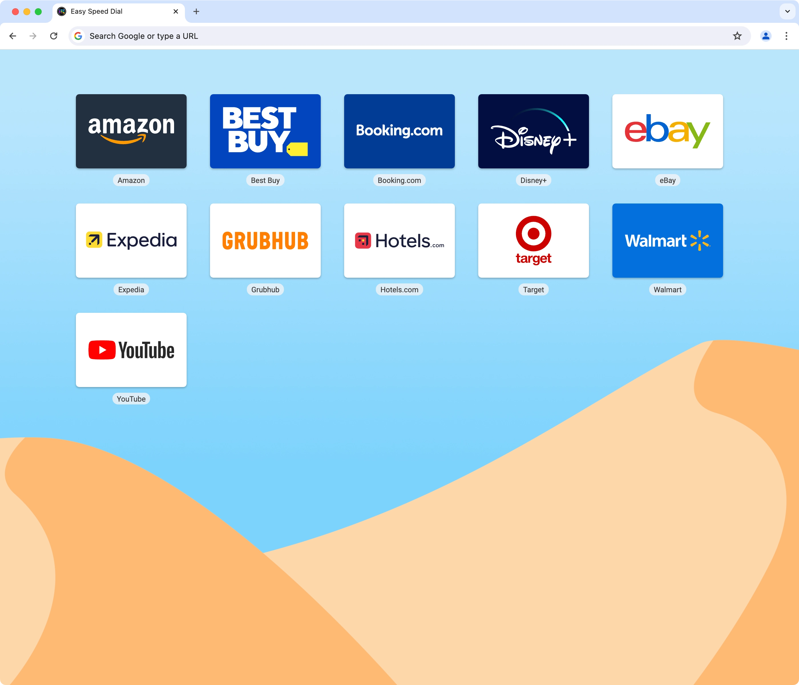

<div style="text-align:center"></div>

# Easy Speed Dial

Easy Speed Dial is a browser extension that replaces the new tab page with a colorful grid of your bookmarks and folders.

## Live Demo

https://demo.easyspeeddial.com/

## Installation

### Clone the repo

```sh
git clone https://github.com/lucaseverett/easy-speed-dial.git
```

### Install packages

```sh
npm install
```

## Usage

### Start dev server

```sh
npm run dev
```

### Run tests once

```sh
npm run test
```

### Run tests and watch for changes

```sh
npm run test:watch
```

## Linting

### Lint with ESLint

```sh
npm run lint
```

### Format with Prettier

```sh
npm run format
```

## Building

### Build web demo

```sh
npm run build
```

### Preview web build

```sh
npm run preview
```

### Build Chrome

```sh
npm run build:chrome
```

### Build Firefox

```sh
npm run build:firefox
```
