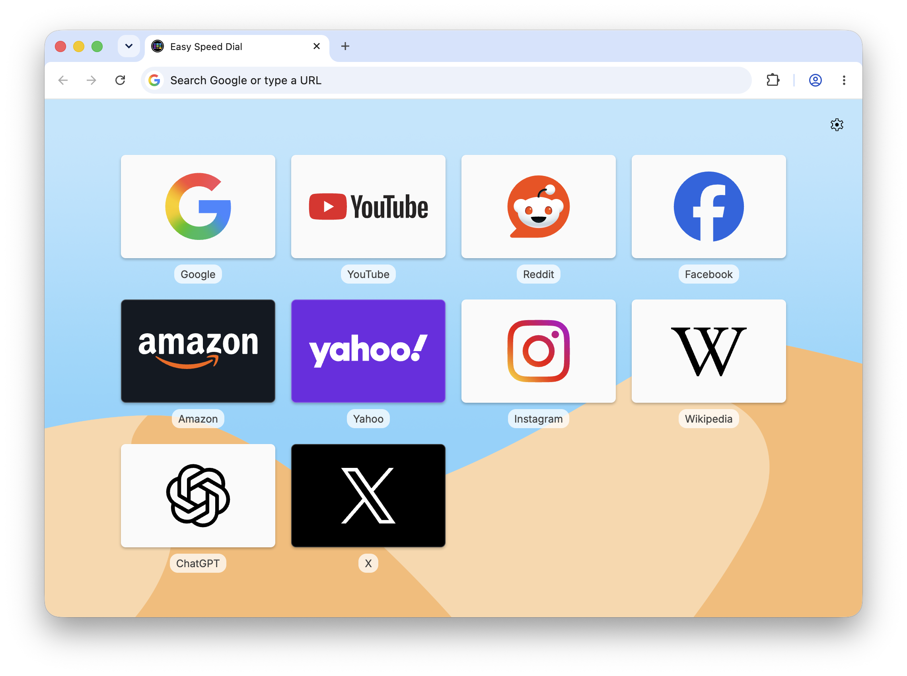

<div style="text-align:center"></div>

# Easy Speed Dial

Easy Speed Dial is a browser extension that replaces the new tab page with a colorful grid of your bookmarks and folders.

## Support Development

If you find this extension useful, consider [buying me a coffee](https://www.buymeacoffee.com/lucaseverett) to support continued development!

## Live Demo

https://demo.easyspeeddial.com/

## Installation

### Clone the repo

```sh
git clone https://github.com/lucaseverett/easy-speed-dial.git
```

### Install packages

```sh
bun install
```

## Usage

### Start dev server

```sh
bun dev
```

#### Dev URL params

The dev server's new tab page recognizes these query params:

- `?dev=new` — simulates a fresh install.
- `?dev=upgrade` — simulates an upgrade from 2.14.0.
  - `&v=<version>` simulates an upgrade from the passed version instead. Anything `semver` can coerce works, e.g. `v=1` or `v=2.10`.

### Run tests once

```sh
bun run test
```

### Run tests and watch for changes

```sh
bun run test:watch
```

## Type Checking

### Check types with TypeScript

```sh
bun tsc
```

## Linting

### Lint with ESLint

```sh
bun lint
```

### Format with Prettier

```sh
bun format
```

## Building

### Build web demo

```sh
bun build
```

### Preview web build

```sh
bun preview
```

### Build Chrome

```sh
bun build:chrome
```

### Build Firefox

```sh
bun build:firefox
```
